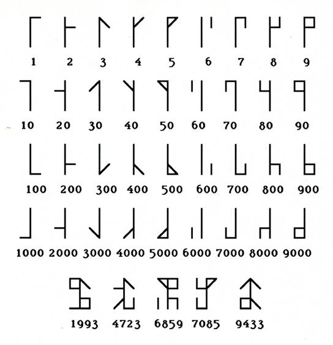

# Cistercian Numerals

Este é um visualizador e gerador interativo de numerais cistercienses — um sistema numérico medieval criado pelos monges da Ordem de Cister no século XIII.
Com ele, você pode:
- Ler uma breve introdução sobre o sistema cisterciense.
- Inserir qualquer número entre 1 e 9999.
- Visualizar a representação gráfica correspondente usando o canvas HTML

## 🔗 Acesse o site
🌐 [vitordefante.github.io/cistercian-numerals](https://vitordefante.github.io/cistercian-numerals/)

## 🛠️ Tecnologias
- HTML5
- CSS3
- JavaScript (Canvas API)

